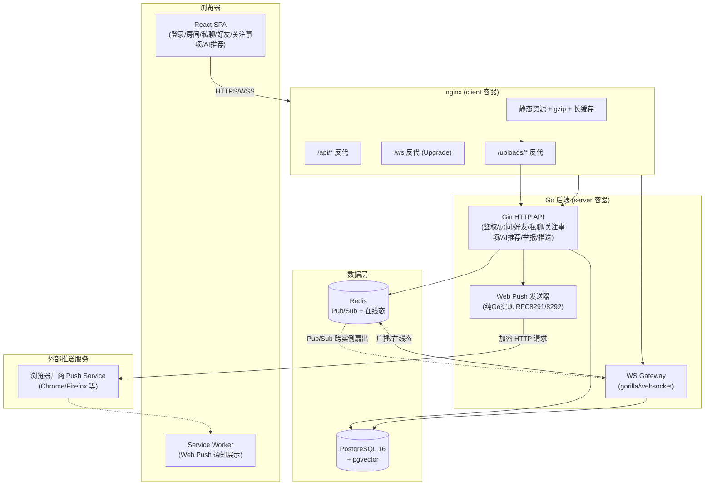

# 架构总览与关键技术决策记录（ADR）

> Task12（部署与运行说明完善）新增：此前的技术决策散落在
> `docs/00-brainstorm-and-plan.md` 的问答式记录（★1-★15）与各 Task work log 中，
> 本文档做一次收敛整理，作为演示/评审时的架构速览入口。完整的需求澄清对话过程
> 仍以 Plan 文档为权威来源，本文档不重复展开决策过程，只汇总结论与理由。

## 一、整体架构图

**多实例横向扩展设计**（强制要求，非可选，见 Plan ★3）：WS Gateway 之间不直连，
全部广播/在线态查询经过 Redis Pub/Sub + 计数器中转，因此图中 `Server` 节点即使
水平扩展为多个副本，架构上无需改动即可正确工作（已在真实多容器环境验证，见
`docs/05-handover.md`「六、Docker 镜像模式验证结果」）。

## 二、关键技术决策记录（ADR，摘自 Plan ★1-★15 + 各 Task work log）

| # | 决策 | 结论 | 理由 |
|---|---|---|---|
| ADR-1 | 后端语言/框架 | Go + Gin + gorilla/websocket | 团队方向偏后台开发，Go 的并发模型天然适合 WS 长连接网关 |
| ADR-2 | 数据库 | PostgreSQL 16 + pgvector 扩展 | 关系型数据 + 预留向量检索能力（AI-native 远期扩展），一套存储不引入额外组件 |
| ADR-3 | 实时通信 | WebSocket + Redis Pub/Sub 多实例扇出 | 强制要求，非可选：即使当前单实例部署，也必须具备水平扩展架构基础，不能"以后需要再重构" |
| ADR-4 | 用户体系 | 账号密码 + 访客模式（JWT） | 降低体验门槛的同时保留正式账号能力 |
| ADR-5 | App 端范围 | 响应式网页（非独立原生 App） | 交付时间预算内聚焦核心体验，响应式网页可覆盖桌面/移动浏览器 |
| ADR-6 | 离线推送 | Web Push（纯 Go 实现 RFC8291/8292，不用第三方 SDK） | 已确认要做，非可选；自实现协议栈避免引入闭源/重依赖，也更贴合"理解并负责最终代码"的要求 |
| ADR-7 | 内容安全完整度 | 基础闭环：敏感词拦截 + 举报记录落库（P0），审核队列/复核台（P1）不做 | 时间预算下先保证"能拦截、能取证"，复核台属于运营后台范畴，非本次产品核心 |
| ADR-8 | AI-native 远期扩展 | Schema 全量预留（`embedding`/`is_bot`/`interaction_events`/`match_candidates`），当前仅规则化推荐演示；**2026-08-19 补充**：新增最小验证——真实机器人账号+LLM(Qwen)驱动生成消息+发好友请求的完整闭环已跑通；**同日追加**：`interaction_events` 首批接入 3 类真实行为事件写入（join_room/send_message/add_friend_request）+ 最小导出工具，验证"数据库到结构化训练数据格式"链路可行 | 训练信号（行为事件）必须从第一天开始记录，历史数据无法回溯补采；模型/机器人本身超出本次交付范围但预留升级路径；最小验证证明了 schema 预留的字段（`is_bot`/`bot_action_log`/`interaction_events`）确实可用，而非纸面预留；历史数据缺口无法弥补，且数据使用授权/opt-in 机制仍未接入（见 `docs/24-training-data-pipeline-work-log.md` 局限说明） |
| ADR-9 | 媒体存储 | 本地磁盘 + 具名 Docker volume | demo/评估场景简化选择，成本为零；生产环境应替换为对象存储（已在 `deploy/docker-compose.yml` 注释与本文档如实标注） |
| ADR-10 | 可观测性 | 结构化日志（含 trace_id）+ 基础 `/metrics`，不接入 Prometheus/Grafana | 已确认范围；单机部署下接入完整监控栈的边际收益低于投入 |
| ADR-11 | 部署方式 | Docker Compose 一键部署 | 单机演示场景足够，避免引入 K8s 等更重的编排复杂度 |
| ADR-12 | 限流策略 | WS 连接级双层限流（2秒突发窗口 + 每分钟长期配额） | 兼顾"防止瞬时刷屏"与"防止长期高频骚扰"两种滥用模式 |

## 三、已知简化点（如实标注，非缺陷）

以下简化点均已在对应代码注释/文档中标注，评审时如实说明，不隐藏：

1. **媒体存储用本地磁盘**（ADR-9）：生产环境应替换为对象存储（S3/COS 等）。
2. **VAPID 密钥未配置时自动生成临时密钥**：重启后旧浏览器订阅失效，生产环境应
   固定配置（见 `server/internal/config/config.go` 注释）。
3. **敏感词库为固定小词表**：生产环境应替换为可运营的词库管理系统。
4. **AI 推荐为规则化简单实现**（关键词交集 + 共同房间打分），非模型驱动；
   **2026-08-19 补充**：已新增独立的最小验证工具 `server/cmd/bot`，用真实
   LLM(Qwen) API 驱动一个 `is_bot=true` 账号在房间发消息+发好友请求，证明
   `is_bot`/`bot_action_log` 等预留字段确实可用（详见
   `docs/23-llm-bot-minimal-validation-work-log.md`）；但这仍是一次性运行的
   确定性工具，不是自主决策的常驻服务，与 Plan 原始设想"机器人自主进行前期
   社交"仍有本质差距，`embedding`/`proxy_for_user_id`/`interaction_events`
   仍未接入真实语义匹配逻辑。
5. **房间不支持用户自建**：当前为运营预置的 4 个固定兴趣房间（Plan 问题#6 已确认）。

## 四、性能与成本落地记录（Task10）

- **索引**：`friendships`/`conversations`/`match_candidates` 三张双向关系表补齐了
  此前遗漏的反向索引（`migrations/0003_perf_indexes.up.sql`），避免 `WHERE (a=$1
  OR b=$1)` 查询模式退化为全表扫描。
- **连接池**：PostgreSQL 连接池大小从硬编码改为可配置（`POSTGRES_MAX_CONNS`/
  `POSTGRES_MIN_CONNS`），默认值不变，压测/扩容时可直接调环境变量。
- **静态资源**：nginx 开启 gzip；Vite 构建产物按 content hash 命名，`/assets/`
  下资源可安全设置一年强缓存（`immutable`），降低重复访问带宽成本。
- **镜像体积**：前后端均采用多阶段构建（builder + 轻量运行时基础镜像
  `alpine`/`nginx:alpine`），当前镜像大小 server ≈ 80MB、client ≈ 76MB，
  已属精简水平，未见进一步压缩空间（Go 静态二进制 + alpine 运行时已是常规最佳实践）。
- **前端产物体积**：生产构建后 JS ≈ 260KB（gzip 后 ≈ 82KB），单页应用当前页面
  数量下无需代码分割（code splitting），体量增长后可按路由懒加载优化，暂非当务之急。
