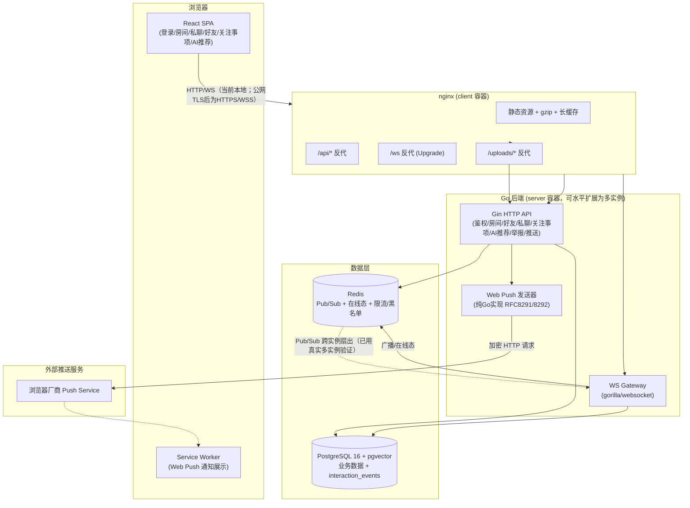

# 最终演示与答辩脚本：完整产品演示 + 架构介绍 + 关键技术方案 + AI 使用方式

> 本文档专门对应课题要求的最后一条："最终需要能够完整演示产品，并介绍整体架构、
> 关键技术方案以及 AI 在开发过程中的使用方式"。
>
> 定位：这是一份**可以直接拿着讲**的演示脚本（讲什么、做什么、每一步预期效果），
> 整合了 `docs/14-demo-guide.md`（此前的演示脚本，未包含本轮新增能力）、
> `docs/13-architecture-and-adr.md`（架构决策记录，偏文档化）、
> `docs/15-ai-usage-notes.md`（AI使用记录）三份文档的内容，补齐了近期新增的
> 能力（加好友气泡、未读精确数字、登出黑名单、多实例横向扩展验证、LLM机器人
> 最小验证、用户行为数据导出），并按"演示时该怎么讲"的顺序重新组织，而不是按
> 开发时间顺序。
>
> 建议演示总时长：**25-30分钟**（核心闭环15-20分钟 + 架构/技术方案介绍
> 5-8分钟 + AI使用方式介绍3-5分钟），可根据评审时间灵活裁剪——若时间紧张，
> 优先保证"第一部分核心聊天体验"与"六、整体架构介绍"两块不删减。

---

## 零、演示前准备（5分钟内完成）

```bash
cd v2

# 1. 一键启动（若尚未启动）
docker compose -f deploy/docker-compose.yml up -d --build

# 2. 等待服务就绪
./scripts/smoke_test.sh http://localhost:8080

# 3. 预置演示数据（demo_alice/demo_bob 账号 + 好友关系 + 关注事项 + AI推荐候选，幂等可重复运行）
python3 scripts/demo_seed.py http://localhost:8080

# 4. （可选，向评审展示"接口都是真实可用的"）
python3 scripts/integration_test.py http://localhost:8080
```

浏览器打开两个窗口（一个正常窗口 + 一个隐私窗口，避免登录态互相覆盖）：
- 前端：`http://localhost:8081`
- 分别用 `demo_alice` / `demo_bob` 登录（密码见 `scripts/demo_seed.py` 内配置，
  默认 `Demo123456`）

---

## 一、开场：一句话定位产品

> "这是一个'兴趣搭子在线聊天室'——用户可以按兴趣主题进入不同的群聊房间，跟
> 在线的其他用户实时聊天，认识聊得来的人后可以加好友、私聊，系统还会基于
> 大家填写的'关注事项'做简单的兴趣匹配推荐。整个项目从0到1由AI编程助手
> 辅助完成，我会在演示完产品功能后，专门讲一下整体架构、关键技术决策，以及
> AI 在开发过程中具体是怎么用的。"

---

## 二、核心演示：产品功能与用户体验闭环（约15分钟）

### 第一部分：核心聊天体验（约5分钟）

1. **房间列表**：首页展示预置的兴趣房间（数码/追番/运动/美食）。
   > "房间是运营预置的4个固定主题，暂不支持用户自建——这是产品设计上的
   > 主动选择，不是没做完，详见架构文档里的决策记录。"
2. **进群聊天**：alice/bob 都进入同一房间（如"数码"），互相发消息：
   - 实时双向收发（WebSocket，非轮询）
   - 在线人数实时更新
   - 消息展示真实用户名
3. **发图片**：任一窗口上传图片，展示实时到达对方窗口。
4. **点击用户名快捷加好友（近期新增）**：alice 点击 bob 发言旁的用户名，
   弹出气泡卡片，展示"加为好友"按钮，点击后气泡内即时反馈"已发出好友请求，
   等待对方处理"。
   > "群聊本身不要求好友关系就能发言，这是产品设计上合理的低门槛选择；但
   > 用户反馈'认识一个聊得来的人后加好友太麻烦'，所以补了这个点用户名直接
   > 加好友的能力，不需要跳出聊天室去好友页手动查找。"
5. **XSS 防护**：消息框输入 `<script>alert(1)</script>` 发送，展示对方收到
   的是转义后的纯文本，不会执行脚本。

### 第二部分：好友、私聊与未读提醒（约5分钟）

1. bob 好友页接受 alice 刚发起的请求，展示导航栏"好友"图标从**精确数字**
   （近期新增，非仅一个圆点）变化。
2. alice 点击 bob 卡片"发消息"进入私聊页，双向收发；bob 侧导航栏"私聊"
   显示未读精确数字（同样是近期新增能力）。
   > "此前未读提醒只有一个圆点，看不出有多少条。现在好友请求数是从后端拉取
   > 真实基准值+WS事件累加得来的精确数字；私聊未读如实说明是'本次会话期间
   > 收到的新消息数'，因为后端目前没有持久化的已读游标，我们没有打着'精确'
   > 的旗号展示一个没有数据支撑的假数字。"
3. **登出即时失效（近期新增）**：点击退出登录，说明：
   > "此前'登出'只是前端清本地存储，服务端在 token 自然过期（默认24小时）
   > 前依然认可它——如果token泄露，点登出实际上什么都没做。现在登出会让
   > 服务端把这个token加入Redis黑名单立即失效，HTTP和WebSocket两条鉴权
   > 路径都生效。"

### 第三部分：AI-native 预留能力（约5分钟）

1. 打开"关注事项"页，展示预置的关注关键词（如"摄影"）。
2. 打开"AI推荐"页，生成推荐，展示候选列表含匹配理由与打分；确认后一键
   转化为好友请求，形成完整闭环。
3. 打开 Web Push 通知开关，说明后端是纯 Go 实现 RFC8291/8292 协议，不依赖
   第三方推送 SDK；若离线私聊消息弹出系统通知即完整走通端到端链路。
4. **LLM 驱动机器人最小验证**（可选，需提前配置 `LLM_API_KEY`）：现场执行
   `cd server && go run ./cmd/bot`，展示终端输出——机器人账号登录、标记
   `is_bot=true`、真实调用 Qwen LLM 生成一条开场白、通过 WS 发到房间并收到
   广播确认、写入 `bot_action_log`、向指定用户发起好友请求；随后切到浏览器
   刷新对应房间，展示发言人正确显示为 `xxx（机器人）` 标识。
   > "这不是硬编码的演示话术——每次运行内容都不一样，因为真的是调用大模型
   > API 现场生成的，终端里会打印 token 用量证明发生过真实网络请求。"
5. **用户行为数据导出最小验证**（可选）：机器人发送消息后执行：
   ```bash
   cd server
   EXPORT_USERNAME=ai_zhidai_bot go run ./cmd/export_training_data
   ```
   展示带`format_version`的JSON，其中包含账号画像、关注事项与真实
   `join_room`/`send_message`行为事件；也可用全新账号发一次好友请求，展示
   `add_friend_request`事件。强调：事件表此前只是schema预留，本轮才开始真实
   写入；这证明"原始业务数据→训练格式"链路可行，不等于已经完成用户替身训练。
6. 一句话说明预留与验证边界：
   > "当前AI推荐是规则化实现（关注事项关键词交集+共同房间打分）；'LLM驱动
   > 机器人'这个更远期的方向，此前只停留在schema预留，现在已经补了一个最小
   > 的、真实可运行的验证闭环；用户行为也已开始记录并可导出为结构化JSON。
   > 但这仍是一次性运行的确定性工具和基础事件流水，不是能自主决定'什么时候
   > 该发言'的常驻服务，也没有数据训练授权/画像聚合，这些差距我们是清楚的。"

---

## 三、进阶演示（可选，时间充裕时展示，体现后台工程质量）

### 3.1 内容安全与限流（约2分钟）

- 发送含内置敏感词的消息，展示不会出现在聊天记录（命中即拦截，不落库不广播）。
- 连续快速发送10条以上消息，展示触发限流提示。

### 3.2 可靠性：优雅关闭（约1分钟）

```bash
docker kill --signal=TERM deploy-server-1
```
展示浏览器 WS 连接收到真实 Close 帧而非静默断连；随后：
```bash
docker compose -f deploy/docker-compose.yml up -d server
```

### 3.3 多实例横向扩展 + 故障自动恢复（约3分钟，体现架构验证深度）

> "架构文档一直说'Redis Pub/Sub 支持多实例横向扩展'，但如果一直只跑一个
> 进程，这句话就只是声明。我们额外搭了一套多实例验证拓扑，实测证实这一点。"

```bash
# 起第二个独立后端进程 + nginx 负载均衡（叠加在默认部署之上）
docker compose -f deploy/docker-compose.yml -f deploy/docker-compose.multi-instance.yml up -d --build

# 验证负载均衡真实分流 + 跨实例广播/私聊
python3 scripts/multi_instance_test.py http://localhost:8082

# 真实故障注入验证：kill掉一个实例、断开Redis/Postgres，验证自动恢复
./scripts/resilience_test.sh http://localhost:8082
```

展示输出结果：负载均衡确认分流到2个不同实例；两个WS连接分别落在不同物理
进程仍能互相收到广播；`docker stop`某个实例后服务整体不中断，恢复后自动
重新加入负载均衡池；Redis/Postgres故障后`/readyz`正确报告并自动恢复。

演示完清理：
```bash
docker compose -f deploy/docker-compose.yml -f deploy/docker-compose.multi-instance.yml stop server2 lb
docker compose -f deploy/docker-compose.yml -f deploy/docker-compose.multi-instance.yml rm -f server2 lb
```

---

## 四、整体架构介绍（演示后讲解，约5分钟）

### 4.1 架构图



### 4.2 讲解口径（可直接照读）

> "整体是三层：最上面是React SPA前端，用nginx做静态资源服务+反向代理；
> 中间是Go+Gin的后端，分HTTP API和WebSocket网关两条链路；底层是PostgreSQL
> 存业务数据，Redis负责WebSocket的跨实例广播、在线状态、限流计数器和登出
> 黑名单这些需要高频读写但可以容忍丢失的数据。
>
> 后端内部是标准的三层：`api` handler 负责HTTP路由和参数校验，`service`
> 层放业务逻辑，`repository`层做数据访问，依赖通过构造函数手工注入，没有
> 引入DI框架——当前项目规模下手工装配是可控的，但如果继续做大，这里会是
> 第一个需要引入依赖注入框架的地方，这个判断我们是清楚的。
>
> 最关键的一个架构决策是：WebSocket网关之间不能直连广播，所有的房间消息
> 广播、私聊投递、在线人数统计，都必须经过Redis Pub/Sub中转。这不是为了
> '显得架构高级'，而是从第一天就确定的强制要求——即使现在默认是单实例部署，
> 这套设计也保证了如果要水平扩展成多个进程，代码不需要改一行。而且这不是
> 一句空话，我们额外搭了一套真实的多实例验证环境去证实这一点（刚才演示过），
> 用两个真正独立的进程、通过负载均衡分流之后，互相之间的广播和私聊确实是
> 通过Redis转发的，不是同一个进程自己发布自己订阅。"

---

## 五、关键技术方案（约3分钟）

按主题串讲，每个点一句话决策+一句话理由：

| 技术点 | 决策 | 一句话理由 |
|---|---|---|
| 实时通信 | WebSocket + Redis Pub/Sub 多实例扇出 | 强制要求非可选，保证架构从第一天就具备水平扩展能力 |
| 数据库 | PostgreSQL 16 + pgvector | 关系数据+向量检索一套存储搞定，为AI推荐远期升级预留 |
| 行为数据 | `interaction_events` + 版本化JSON导出 | `join_room`/`send_message`/`add_friend_request`已真实记录并能导出，验证训练数据管道最小链路 |
| 鉴权 | JWT + Redis黑名单撤销 | 无状态鉴权的同时补上"登出即时失效"这个JWT天生缺的能力 |
| 离线推送 | 纯Go实现Web Push协议（RFC8291/8292） | 不依赖第三方SDK，自己理解并实现整套加密协议 |
| 内容安全 | 敏感词拦截+举报机制 | 时间预算下先保证"能拦截、能取证"这个基础闭环 |
| 部署 | Docker Compose，支持overlay方式叠加多实例拓扑 | 单机demo场景的最优性价比，同时验证了不修改代码即可横向扩展 |

**主动确认的设计边界**（讲清楚"为什么没做"，比"全部做完"更能体现工程判断力）：
- 不接入Prometheus/Grafana（`/metrics`是自实现的简易JSON输出）——单机部署下
  接入完整监控栈边际收益低于投入
- 房间不支持用户自建——运营预置4个固定主题，产品范围内的主动选择
- 无HTTPS/TLS——当前尚无公网云端部署/真实域名，无法让评委直接通过公网URL
  体验；获得云实例后应优先绑定域名并补TLS，部署/独立压测计划见`docs/25-current-status-and-cloud-deployment-plan.md`

---

## 六、AI 在开发过程中的使用方式（约3-5分钟）

### 6.1 整体工作模式

> "整个项目从0到1都是我用AI编程助手（基于Agent工具调用模式）辅助完成的，
> 但不是'我说一句话它把所有代码都写完'这种黑盒模式。整体流程是：需求澄清
> → 任务拆解 → 先写验收用例 → 再编码+真机验证，每个功能模块完整走一遍这个
> 循环，而不是一次性生成整个仓库再统一测。"

- **需求澄清**：把"做一个兴趣聊天室"这句模糊需求，扩写成15个结构化的技术
  决策问题（用户体系怎么设计、是否支持私聊、AI推荐做到什么程度等），逐项
  确认后才定稿，避免AI自己猜一个方案就开始写。
- **任务拆解**：拆成20个显式任务（Task0-20），标注依赖关系，可以分批交付
  分批验证。
- **验收用例先行**：编码前先写好接口级验收用例清单，明确"怎样才算做完"。
- **编码+真机验证**：每完成1-3个任务，跑单测+集成测试+重建Docker镜像+
  真实浏览器多用户联动测试，把验证结果（包括踩坑和失败过程）如实记录到
  工作日志里。

### 6.2 AI 实际承担的工作

> "全部代码——后端Go、前端React、数据库迁移脚本、Docker/nginx配置——都是
> AI写的。测试设计（单测/集成测试/真实浏览器多用户端到端测试用例）也是
> AI设计并执行的。"

真实的问题排查案例（AI在真实环境验证时自主定位并修复，非人工发现后指派）：
- 前端API路径 `/api` 前缀叠加导致请求变成 `/api/api/xxx`（仅真实浏览器
  网络请求才能观察到）
- PostgreSQL 对 UUID 类型列做 `= ANY($1)` 查询时，非法UUID格式字符串直接
  报500而非"查不到"
- `elliptic.Marshal` 废弃API，接入 `golangci-lint` 才系统性发现

### 6.3 人工介入的关键节点

> "AI没有全自动完成这个项目。所有技术选型的最终决策——用什么语言、什么
> 数据库、私聊要不要限制好友关系、内容审核要做到什么程度——都是我在AI给出
> 选项和权衡之后明确拍板的。验证节奏、产品范围边界这些也都是我来决定，AI
> 不会自己擅自决定跳过某个方向或扩大范围。"

### 6.4 如实说明局限性

> "AI生成的代码比例很高，几乎是全部业务代码，但每一处关键设计决策都有对应
> 的人工确认记录，这是我理解并对最终代码、技术方案和产品质量负责的依据。
> AI的验证手段——真实Docker环境+真实浏览器多用户测试——比纯粹的单元测试
> 更接近生产场景，但仍不能完全替代真实用户的可用性反馈，UI细节的美观度
> 更多依赖AI训练知识里'好的UX实践'，不是针对性的用户调研结果。"

---

## 七、收尾总结（一句话）

> "总结一下：这是一个功能完整、经过真机验证的全栈demo产品，重点在于对后台
> 工程质量的思考——实时通信的多实例架构是真实验证过的，不是纸面声明；安全性
> /可靠性/测试覆盖率/性能基准这些方向做了及格线以上的基础工作，同时我们清楚
> 知道离生产级还差什么（HTTPS、真实监控告警、更扎实的压测），这些差距和原因
> 都写在文档里，不是隐藏的技术债。"

---

## 八、常见追问预案

| 追问 | 回答口径 |
|---|---|
| 这个能直接上生产吗？ | 不能，当前尚未公网部署，还差HTTPS/TLS、真实监控告警系统、更扎实的独立压测数据；但多实例架构已真实验证，云端部署计划见`docs/25` |
| 测试覆盖率多少？ | 当前全项目加权**52.8%**（`go tool cover -func`实测）；`api`75.5%、`middleware`94.7%、`ws`61.2%、`service`67.6%、`repository`30.4%。早期58%因新增0%覆盖率命令层后分母扩大而更新，需如实说明 |
| LLM机器人与用户替身是否已实现？ | 已跑通机器人账号+真实Qwen生成消息+WS披露+好友请求，以及基础行为事件记录/JSON导出；但它是一次性最小验证，不是自主决策常驻服务，未有用户数据训练授权/画像聚合 |
| 评委能直接用公网访问吗？ | 目前不能，当前无云端实例和公网URL；获得可用Lighthouse实例后按`docs/25`部署，推荐4核8GB并从独立压测端验证 |
| AI写的代码你都看过吗？ | 每个功能模块都经过编译+单测+真机验证这个流程，关键架构决策我都参与确认，不是没看过就提交 |
| 为什么不用Kubernetes？ | 单机Docker Compose对当前demo场景是最优性价比选择，这是ADR-11里的主动决策；我们额外验证了应用层已经支持多实例，如果要上K8s，改的是编排配置，不是应用代码 |
| AI生成代码比例是多少？ | 几乎全部业务代码由AI编写，但每处关键设计决策（技术选型、产品范围边界）都由我确认拍板，详见`docs/15-ai-usage-notes.md`的人工介入节点记录 |

---

## 九、相关文档索引

| 需要更详细内容时查阅 | 文档 |
|---|---|
| 完整需求澄清过程与任务清单 | `docs/00-brainstorm-and-plan.md` |
| 架构图+全部12条ADR决策记录 | `docs/13-architecture-and-adr.md` |
| LLM驱动机器人最小验证详细过程 | `docs/23-llm-bot-minimal-validation-work-log.md` |
| 用户行为数据到训练JSON的最小管道 | `docs/24-training-data-pipeline-work-log.md` |
| 当前运行状态、云端部署与独立压测计划 | `docs/25-current-status-and-cloud-deployment-plan.md` |
| AI使用方式完整记录 | `docs/15-ai-usage-notes.md` |
| 测试覆盖率提升详细过程 | `docs/19-test-coverage-work-log.md` |
| 多实例部署与运行时可靠性验证详细过程 | `docs/20-deployment-runtime-testing-work-log.md` |
| 逐项对照9个考察方向的诚实评估 | `docs/21-submission-handover.md`
| 接口级验收用例清单 | `testcase/00-testcase-plan.md` |
